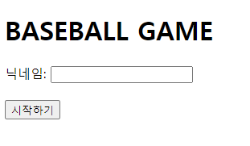
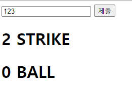
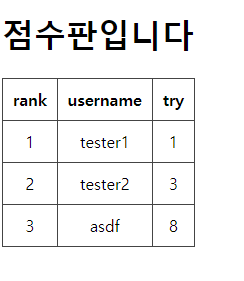

# spring-baseball

숫자 야구게임

### 게임 방법
- 이름 입력시 세 자리 랜덤한 숫자 생성
  - 
- 세자리 숫자를 예상하여 제출할 수 있음.
  - 같은 자리 같은 숫자 -> strike
  - 다른 자리 같은 숫자 -> ball
  - 숫자가 일치하지 않는 경우 -> 0 strike 0 ball
  - 예1) 문제: 123, 답: 321 -> 2 ball 1 strike
  - 예2) 문제: 426, 답: 543 -> 1 ball
  - 
- 3개의 숫자를 모두 맞히면 게임이 종료.
  - 

### 코드 설명
- 지키려고 노력한 규칙들
  - 생성자 대신 팩토리 메소드 패턴을 사용
  - 원시 타입 대신 불변 객체 사용
  - 일급 객체 사용
  - getter, setter 사용 대신 명확한 이름을 가진 메소드 사용
